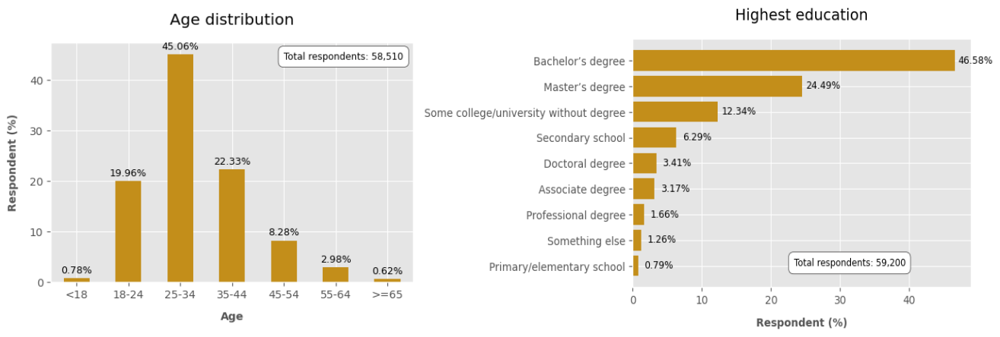
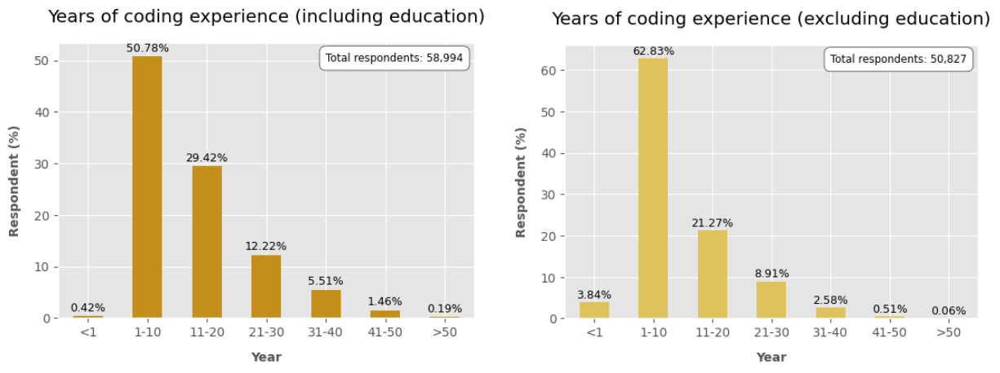
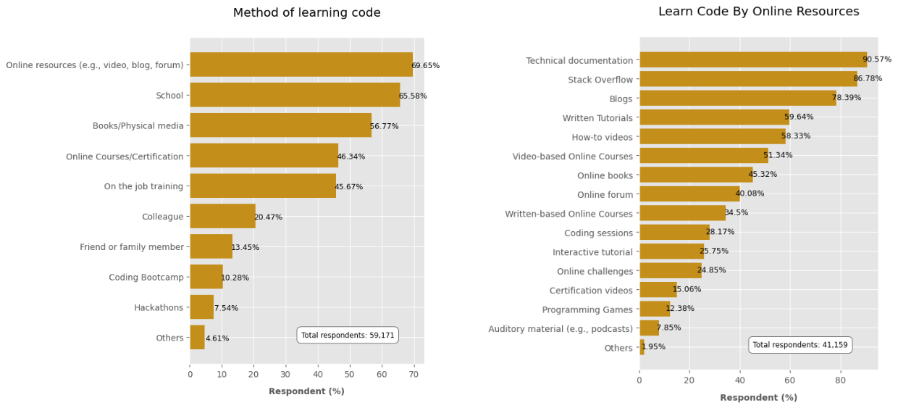
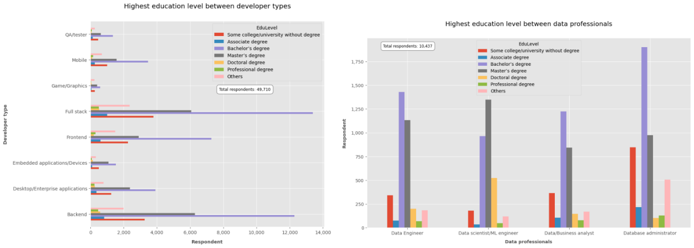
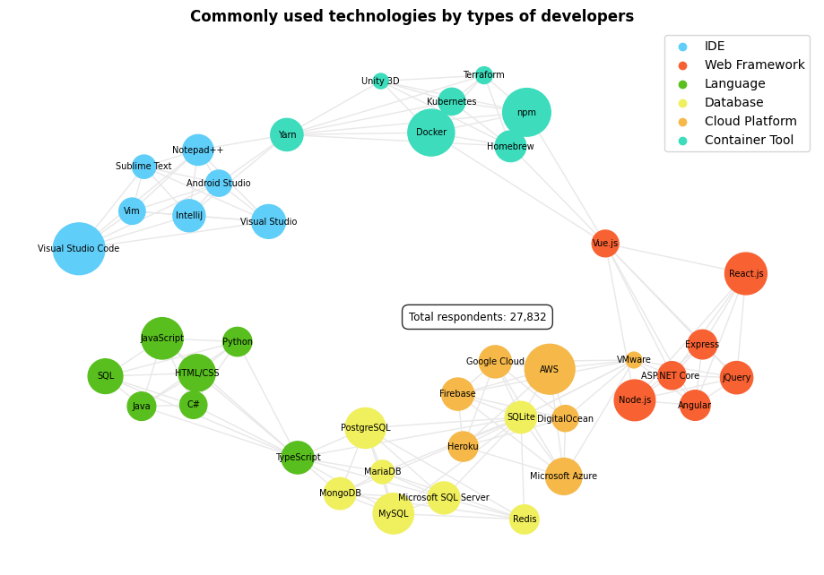
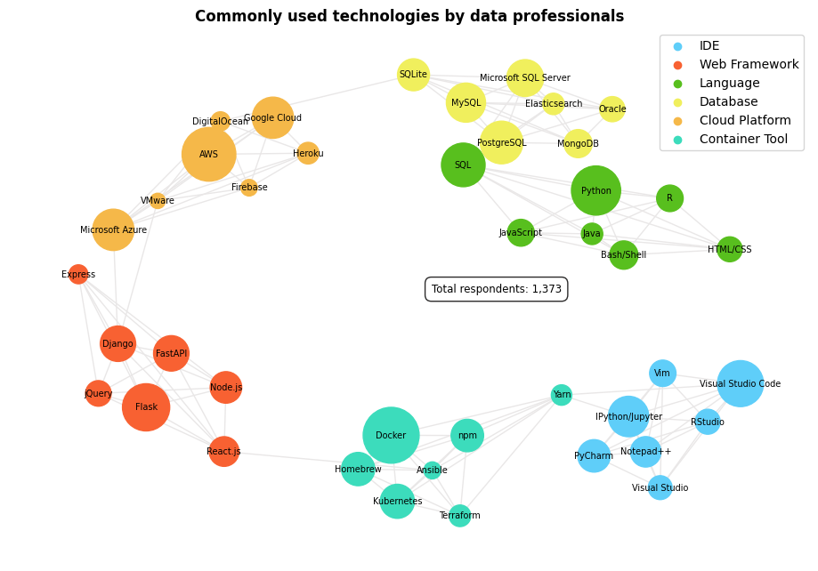

# How do developers around the world advance their careers?
> "Learning to write programs stretches your mind, and help you think better, creates a way of thinking about things that I think is helpful in all domains"

Bill Gates - Co-founder of Microsoft

 

Coding is one of the most valuable skills you can build in this 21st century. Nowadays, not only developers or IT professionals write code but also people in other fields. 
Everyone who write code as either their profession or not a profession typically at least one time find the answers about coding or technical knowledge in Stack overflow. 
Stack overflow is the largest and trusted online community gathering developers around the world to learn, share knowledge and build their career.

<em>Have you ever wondered how developers around the world advance their careers?</em>

In this blog post, the insights drawn from Stack overflow developer survey data in 2022 will help you better understand that.

Let’s first take a look at respondent profiles.

<h2>Demographic</h2>

Respondents that were taken into this analysis are either developer by profession or not primarily a developer but write code sometimes as part of work.
So the term “developer” used in this post refers to some who write code.

Most of developers aged from 18 to 44 years old with bachelor’s degree as their highest education level.

Years of work experience, either including or excluding education (also known as professional experience) is mostly less than ten years.

Most developers come from USA, Europe and India.

<h2>Part 1: How do developers learn and level up their coding skill?</h2>

As a developer, continuous learning to catch up with new technology and keep technical skills sharp are crucial to stay in the field.

More than half of developers choose to learn code via Online resources (e.g., video, blog, forum) as their most trusted source. By that source, they typically learn from Technical documentation and Stack Overflow. Learn and level up coding skill by Online Course/Certification is also a popular learning method.

There are several online learning platform nowadays. Though the survey, we learned that Stack Overflow community commonly choose Udemy (68,65%) and Coursera (35,91%) for online learning.

We can conclude that most developers are often self-taught to find answers and resources themselves. That turns to the question about the importance of education level in part 2.

<h2>Part 2: Which IT career option is interested in advanced education that goes beyond bachelor's degree?</h2>

The doctoral or professional degree is generally known as the highest level of schooling. As such, careers that require extensive and professional knowledge typically require the most education.

From this chart, we can notice some form of higher education (e.g., Master’s degree, Doctoral degree) completed in each career group, but Bachelor’s degree is the most common. There are also some groups of developers who never earned a degree from college/university but they can be able to become a developer.

In today job market, data-related job is known as sexiest job of the 21st century. Let’s see how this career shows interest in education level in comparison with dev group which is the dominant group in the survey.

Dev group seems to be less interested in higher education while data professionals show more interest in advanced education, especially for the roles such as data scientist or machine learning engineer. It can’t be concluded that data group is studious than dev group due to the differences between the two industries.

Dev group has the lowest barriers to break into the field right now. They don’t really need a degree to be successful in their field as they can make them more employable through open source projects, contribute to developer community to learn, build their reputation and portfolio.

In contrast, the roles like data scientist or machine learning engineer, data engineer require more in-depth and comprehensive knowledge that needs formal education program at university.

<h2>Part 3: Which technologies have been commonly used by developer?</h2>

Top seven technologies that have been used by developers and data professionals over the past year were clustered across IDE, Web Framework, Language, Database, Cloud Platform and Container Too

Anyone who is learning code and/or don’t know where to start can rely on this insight to choose right tool, right technology that fits the industry.

<h2>Conclusion</h2>

This post has been discussed the ways that developers around the world advance their careers. No matter it’s formal education programs from university or informal training (e.g., online course, certification, blog,…), continuous learning and self-taught to keep up with emerging technologies and improve needed mindset in the field are key to be more employable in IT job market. 

